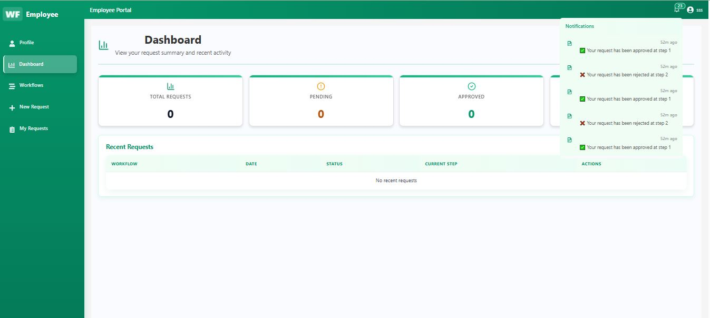
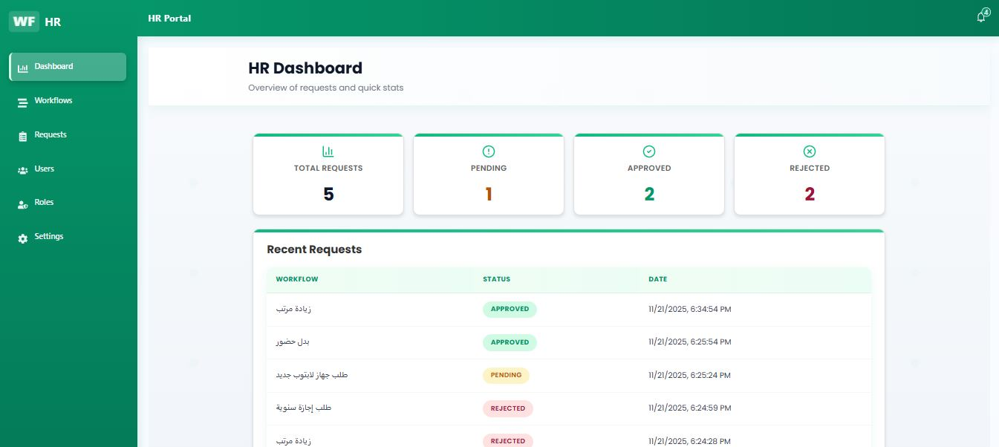
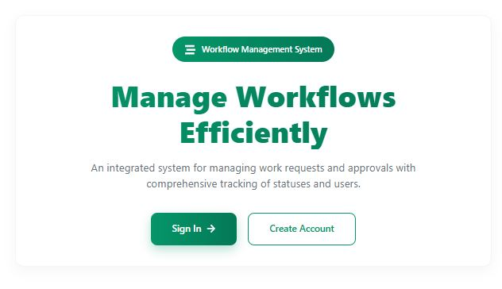
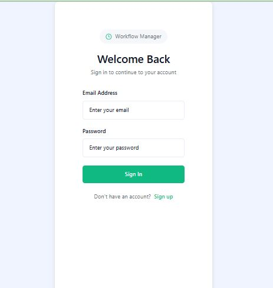
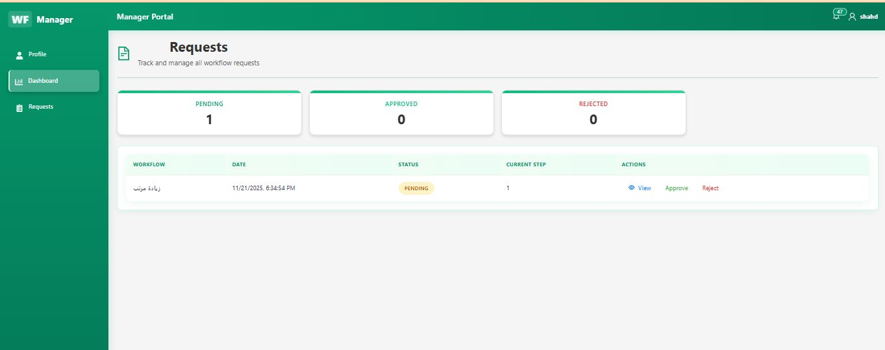
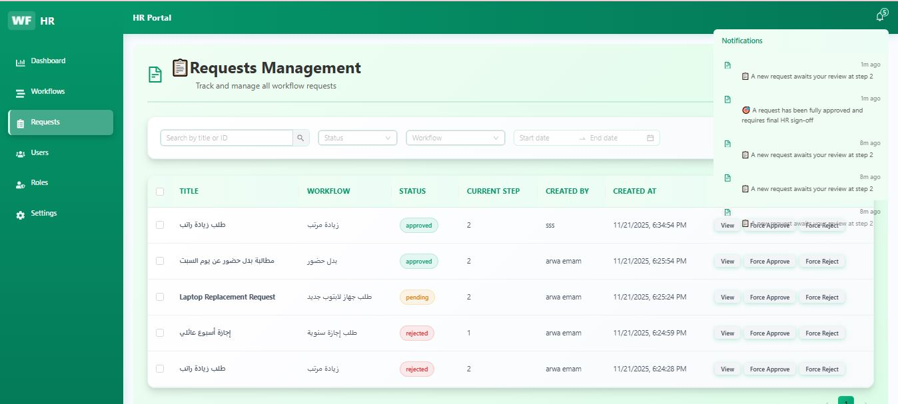

# React + TypeScript + Vite

This template provides a minimal setup to get React working in Vite with HMR and some ESLint rules.

Currently, two official plugins are available:

- [@vitejs/plugin-react](https://github.com/vitejs/vite-plugin-react/blob/main/packages/plugin-react) uses [Babel](https://babeljs.io/) (or [oxc](https://oxc.rs) when used in [rolldown-vite](https://vite.dev/guide/rolldown)) for Fast Refresh
- [@vitejs/plugin-react-swc](https://github.com/vitejs/vite-plugin-react/blob/main/packages/plugin-react-swc) uses [SWC](https://swc.rs/) for Fast Refresh

## React Compiler

The React Compiler is not enabled on this template because of its impact on dev & build performances. To add it, see [this documentation](https://react.dev/learn/react-compiler/installation).

## Expanding the ESLint configuration

If you are developing a production application, we recommend updating the configuration to enable type-aware lint rules:

```js
export default defineConfig([
  globalIgnores(['dist']),
  {
    **مشروع واجهة Workflow (React + TypeScript + Vite)**

    ملخص سريع (بالعربي):

    - هذا المشروع هو واجهة أمامية مبنية بـ `React` + `TypeScript` ويدار عبر `Vite`.
    - تنسيق الملفات: المكونات في `src/`، الصور والميديا في `src/assets`.
    - تم استخدام مكتبات UI مثل Ant Design وبعض أيقونات `lucide-react`.

    Quick summary (English):

    - Frontend app built with `React` + `TypeScript` and powered by `Vite`.
    - Components live under `src/`. Static images are kept in `src/assets`.
    - Uses Ant Design and lucide-react for UI and icons.

    ---

    **معلومات النظام (System info)**

    - Node/npm: Use a recent Node.js (18+ recommended) and npm.
    - Run the dev server (PowerShell):

    ```powershell
    npm install
    npm run dev
    ```

    - Build for production:

    ```powershell
    npm run build
    ```

    - Dev server proxy: The Vite dev server proxies `^/api/.*` to the backend at `http://localhost:4000` — see `vite.config.ts`.

    - Authentication: the app stores the JWT token in `localStorage` under the key `auth_token`. Many API calls add `Authorization: Bearer <token>`.

    ---

    **موقع الصور / لقطات الشاشة**

    الصور المرفوعة موجودة في `src/assets`. تم تضمين لقطات للشاشات المهمة أدناه — افتحي الملف محليًا لتأكيد المسارات والأسماء.

    - Employer Dashboard
      

    - HR Manager Dashboard
      

    - Landing Page
      

    - Login
      

    - Manager Dashboard
      

    - Notifications (example)
      

    ---

    **المسارات والصفحات المهمة (Important routes)**

    - `/` — Landing page
    - `/login` — Login
    - `/hr/workflows` — Workflows list (HR)
    - `/hr/workflows/create` — Create workflow page (the form used to create a workflow)
    - `/requests` and role-specific pages live in `src/pages/` and `src/layouts/`

demo https://drive.google.com/file/d/1yvRAS3odhQb6M2v7RWwZKTQTbK6rOv8f/view?usp=sharing


